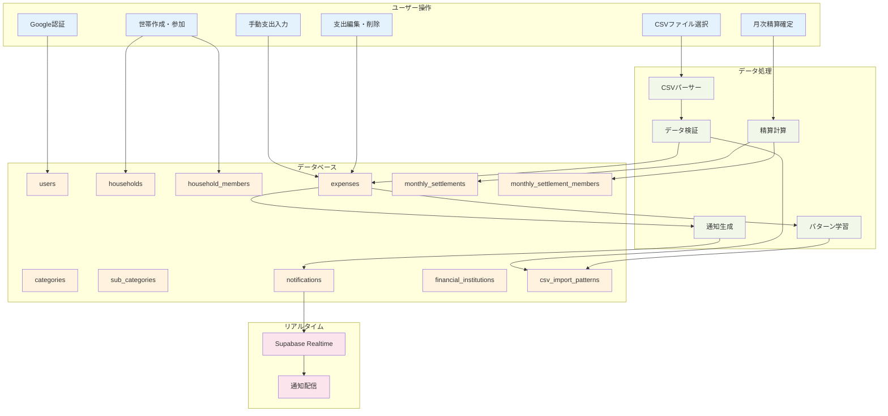
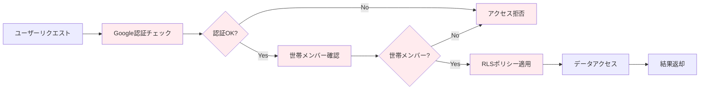

# Couple Balance App - データフロー図

## アプリケーションのデータフロー



## 主要なデータフロー

### 1. 認証・世帯管理フロー
```
Google認証 → usersテーブル → 世帯作成/参加 → household_membersテーブル
```

### 2. CSVインポートフロー
```
CSVファイル選択 → 金融機関判定 → CSVパーサー → データ検証 → 
expensesテーブル保存 → パターン学習 → csv_import_patterns更新 → 通知生成
```

### 3. 手動支出入力フロー
```
支出入力 → データ検証 → expensesテーブル保存 → 通知生成
```

### 4. 月次精算フロー
```
精算対象月選択 → 支出データ取得 → 現在の支払い比率で計算 → 
精算プレビュー表示 → オーナーによる精算確定 → 
monthly_settlements保存 → monthly_settlement_members保存 → 支出編集制限
```

### 4-1. 精算確定解除・再確定フロー
```
オーナーによる精算確定解除 → 支出編集可能化 → 支出データ更新 → 
現在の支払い比率で再計算 → 精算再確定 → 支出編集制限
```

### 5. 通知フロー
```
支出変更 → NotificationService → notificationsテーブル保存 → 
Supabase Realtime → 世帯メンバーに通知配信
```

### 6. カテゴリ管理フロー
```
カテゴリ作成/編集 → categoriesテーブル保存 → 
サブカテゴリ作成/編集 → sub_categoriesテーブル保存
```

### 7. 世帯管理フロー
```
世帯作成 → オーナー設定 → メンバー招待 → 支払い比率調整 → 
メンバー削除 → オーナー変更 → 世帯削除（オーナーのみ）
```

### 8. 支出編集制限フロー
```
精算確定済み月の支出編集要求 → 精算ステータスチェック → 
編集拒否（確定済み） / 編集許可（未確定）
```

## データの流れ

### 入力データ
- **Google認証**: ユーザー情報
- **CSVファイル**: 金融機関の明細データ
- **手動入力**: 現金支出データ
- **世帯設定**: 世帯名、メンバー、支払い比率
- **カテゴリ設定**: カテゴリ名、色、アイコン

### 処理データ
- **支出データ**: 金額、説明、日付、サブカテゴリ（NULL可）、金融機関（NULL可）
- **集計データ**: 月別合計、カテゴリ別合計、世帯別集計
- **精算データ**: 確定時の支払い比率、精算額
- **通知データ**: 支出変更、世帯管理、精算関連の通知メッセージ
- **パターンデータ**: CSVインポート時の自動分類パターン
- **権限データ**: オーナー権限、世帯メンバー権限

### 出力データ
- **月別レポート**: 支出合計と精算額
- **カテゴリ別レポート**: カテゴリ・サブカテゴリ別支出集計
- **精算履歴**: 過去の精算確定記録
- **未設定カテゴリレポート**: カテゴリ未設定の支出一覧
- **リアルタイム通知**: 世帯メンバーの支出変更、世帯管理、精算関連通知
- **権限管理**: オーナー権限による操作制御

## セキュリティフロー



## パフォーマンス最適化

### インデックス戦略
- `expenses.household_id + expense_date`: 世帯・月別検索の高速化
- `expenses.user_id`: ユーザー別検索の高速化
- `expenses.sub_category_id`: サブカテゴリ別検索の高速化
- `monthly_settlements.household_id + settlement_month`: 精算検索の高速化
- `monthly_settlements.status`: 精算ステータス検索の高速化
- `notifications.household_id + user_id`: 通知検索の高速化
- `csv_import_patterns.household_id + user_id + financial_institution_id`: パターン検索の高速化
- `csv_import_patterns.sub_category_id`: サブカテゴリ別パターン検索の高速化

### キャッシュ戦略
- カテゴリ・サブカテゴリ一覧のキャッシュ
- 月別集計結果のキャッシュ
- 世帯メンバー情報のキャッシュ
- 金融機関一覧のキャッシュ

### リアルタイム最適化
- 通知のバッチ処理
- 不要な通知の削除
- 接続数の制限
- 世帯ベースの通知配信
