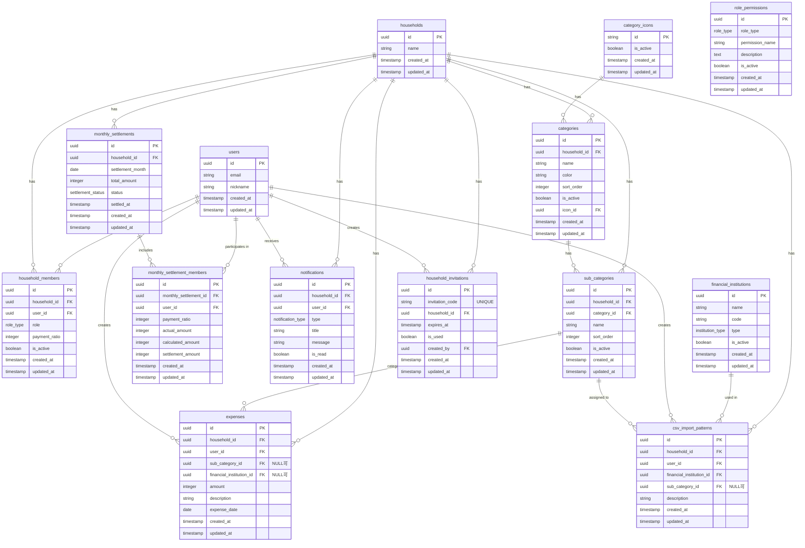

# Couple Balance App - ER図

## データベース設計図

## テーブル詳細

### users（ユーザーテーブル）
- **主キー**: `id` (UUID)
- **説明**: Google認証によるユーザー情報を管理
- **重要フィールド**:
  - `email`: Googleアカウントのメールアドレス
  - `nickname`: 表示名
  - `color`: ユーザーカラー（HEX形式、デフォルト：#3B82F6）
- **用途**: 支出リストでのユーザーアイコン表示時の色分け

### households（世帯テーブル）
- **主キー**: `id` (UUID)
- **説明**: 世帯情報を管理
- **重要フィールド**:
  - `name`: 世帯名
  - `color`: 世帯カラー（HEX形式、デフォルト：#10B981）
- **権限**: オーナーのみ削除可能
- **用途**: 世帯選択画面や世帯情報表示での色分け

### household_members（世帯メンバーテーブル）
- **主キー**: `id` (UUID)
- **外部キー**: 
  - `household_id` → households.id
  - `user_id` → users.id
- **説明**: 世帯メンバーの情報を管理
- **重要フィールド**:
  - `role`: 役割（owner/member）
  - `payment_ratio`: 支払い割合（0-100%）
  - `is_active`: アクティブ状態
- **制約**: 支払い比率の合計は100以下になるようトリガーで制御
- **注意**: 新規メンバーの初期支払い比率は0%

### categories（カテゴリテーブル）
- **主キー**: `id` (UUID)
- **外部キー**: 
  - `household_id` → households.id
  - `icon_id` → category_icons.id
- **説明**: 支出のメインカテゴリを管理
- **重要フィールド**:
  - `name`: カテゴリ名
  - `color`: カテゴリの色
  - `sort_order`: 表示順序
  - `icon_id`: アイコンID

### sub_categories（サブカテゴリテーブル）
- **主キー**: `id` (UUID)
- **外部キー**: 
  - `household_id` → households.id
  - `category_id` → categories.id
- **説明**: 支出のサブカテゴリを管理
- **重要フィールド**:
  - `name`: サブカテゴリ名
  - `sort_order`: 表示順序

### category_icons（カテゴリアイコンテーブル）
- **主キー**: `id` (String)
- **説明**: カテゴリで使用可能なアイコンを管理
- **重要フィールド**:
  - `id`: アイコンID（アプリ側のアセットと対応）

### expenses（支出テーブル）
- **主キー**: `id` (UUID)
- **外部キー**: 
  - `household_id` → households.id
  - `user_id` → users.id
  - `sub_category_id` → sub_categories.id（NULL可）
  - `financial_institution_id` → financial_institutions.id（NULL可）
- **説明**: 支出データを管理
- **重要フィールド**:
  - `amount`: 支出金額
  - `description`: 支出の説明
  - `expense_date`: 支出日
  - `sub_category_id`: NULLの場合は未設定カテゴリ
  - `financial_institution_id`: NULLの場合は手動入力、設定されている場合はCSVインポート
- **制約**: 精算確定済みの月は編集不可

### monthly_settlements（月次精算テーブル）
- **主キー**: `id` (UUID)
- **外部キー**: `household_id` → households.id
- **説明**: 月次精算の確定情報を管理
- **重要フィールド**:
  - `settlement_month`: 精算対象月
  - `total_amount`: その月の総支出額
  - `status`: 精算ステータス（pending/settled/cancelled）
  - `settled_at`: 精算確定日時
- **権限**: オーナーのみ確定・解除・再確定可能

### monthly_settlement_members（月次精算メンバー詳細テーブル）
- **主キー**: `id` (UUID)
- **外部キー**: 
  - `monthly_settlement_id` → monthly_settlements.id
  - `user_id` → users.id
- **説明**: 月次精算時の各メンバーの詳細を管理
- **重要フィールド**:
  - `payment_ratio`: 精算確定時の支払い比率
  - `actual_amount`: 実際の支出額
  - `calculated_amount`: 計算された精算額
  - `settlement_amount`: 最終精算額

### notifications（通知テーブル）
- **主キー**: `id` (UUID)
- **外部キー**: 
  - `household_id` → households.id
  - `user_id` → users.id
- **説明**: リアルタイム通知を管理
- **重要フィールド**:
  - `type`: 通知タイプ（支出変更、世帯管理、精算関連）
  - `title`: 通知タイトル
  - `message`: 通知メッセージ
  - `is_read`: 既読フラグ

### financial_institutions（金融機関テーブル）
- **主キー**: `id` (UUID)
- **説明**: 対応金融機関を管理
- **重要フィールド**:
  - `name`: 金融機関名
  - `code`: 金融機関コード
  - `type`: 機関タイプ（bank/credit_card）

### csv_import_patterns（CSVインポートパターンテーブル）
- **主キー**: `id` (UUID)
- **外部キー**: 
  - `household_id` → households.id
  - `user_id` → users.id
  - `financial_institution_id` → financial_institutions.id
  - `sub_category_id` → sub_categories.id（NULL可）
- **説明**: CSVインポート時の自動分類パターンを管理
- **重要フィールド**:
  - `description`: 支出の説明文
  - `sub_category_id`: 自動分類されるサブカテゴリ（NULLの場合は未設定）

### household_invitations（世帯招待テーブル）
- **主キー**: `id` (UUID)
- **外部キー**: 
  - `household_id` → households.id
  - `created_by` → users.id
- **説明**: 世帯への招待情報を管理
- **重要フィールド**:
  - `invitation_code`: 招待コード（8文字のランダム文字列）
  - `expires_at`: 有効期限（24時間）
  - `is_used`: 使用済みフラグ
- **権限**: 招待作成権限を持つユーザーのみ
- **注意**: 新規メンバーの初期支払い比率は0%

### role_permissions（権限管理テーブル）
- **主キー**: `id` (UUID)
- **説明**: ロールベースの権限制御を管理
- **重要フィールド**:
  - `role_type`: ロールタイプ（owner/member）
  - `permission_name`: 権限名（例：'household.delete', 'payment_ratio.update'）
  - `description`: 権限の説明
  - `is_active`: 権限の有効/無効状態
- **権限**: システム管理者のみ編集可能
- **特徴**: 新しいロールや権限の追加が容易

## リレーションシップ詳細

1. **households → household_members**: 1対多
   - 1つの世帯に複数のメンバーが所属

2. **users → household_members**: 1対多
   - 1人のユーザーが複数の世帯に所属可能

3. **households → categories**: 1対多
   - 1つの世帯が複数のカテゴリを持つ

4. **categories → sub_categories**: 1対多
   - 1つのカテゴリに複数のサブカテゴリが属する

5. **households → expenses**: 1対多
   - 1つの世帯に複数の支出が属する

6. **households → monthly_settlements**: 1対多
   - 1つの世帯に複数の月次精算が属する

7. **monthly_settlements → monthly_settlement_members**: 1対多
   - 1つの月次精算に複数のメンバー詳細が属する

8. **users → expenses**: 1対多
   - 1人のユーザーが複数の支出を作成

9. **users → monthly_settlement_members**: 1対多
   - 1人のユーザーが複数の月次精算に参加

10. **sub_categories → expenses**: 1対多
    - 1つのサブカテゴリに複数の支出が属する

11. **category_icons → categories**: 1対多
    - 1つのアイコンが複数のカテゴリで使用される

## 制約とインデックス

### 制約
- `household_members.payment_ratio`: 1-100の範囲チェック（合計100になるようトリガーで制御）
- `expenses.amount`: 0より大きい値チェック
- `monthly_settlements.household_id + settlement_month`: ユニーク制約
- `monthly_settlement_members.monthly_settlement_id + user_id`: ユニーク制約
- 外部キー制約による参照整合性

### インデックス
- `expenses.household_id + expense_date`: 世帯・日付別支出検索
- `expenses.user_id`: ユーザー別支出検索
- `expenses.sub_category_id`: サブカテゴリ別支出検索
- `monthly_settlements.household_id + settlement_month`: 世帯・月別精算検索
- `monthly_settlements.status`: 精算ステータス検索
- `notifications.household_id + user_id`: 世帯・ユーザー別通知検索
- `csv_import_patterns.household_id + user_id + financial_institution_id`: パターン検索

## セキュリティ

### Row Level Security (RLS)
- すべてのテーブルでRLSが有効
- 世帯ベースのアクセス制御
- ユーザーは自分の世帯のデータのみアクセス可能
- 支出、精算、通知は世帯内で共有
- カテゴリ、パターンは世帯内で共有

## 月次精算機能の特徴

### 精算確定プロセス
1. **プレビュー作成**: その月の支出と現在の支払い比率で精算額を計算
2. **確定**: オーナーが精算を確定
3. **履歴保存**: 確定時の支払い比率と精算額を永続化
4. **支出編集制限**: 確定後の月は支出の追加・編集・削除を制限

### 精算再確定プロセス
1. **確定解除**: オーナーが精算確定を解除
2. **支出編集**: 支出の追加・編集・削除が可能に
3. **再計算**: 現在の支払い比率で精算額を再計算
4. **再確定**: オーナーが精算を再確定

### データの不変性
- 過去の精算額は支払い比率の変更に影響されない
- 精算確定時の比率と金額が固定保存される
- 履歴として正確な精算記録を保持
- 精算確定済みの月は支出編集を制限してデータ整合性を保護
