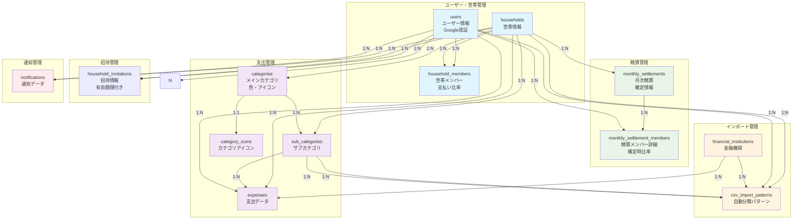

# Couple Balance App - シンプルER図

## データベース構造図

## テーブル概要

| テーブル名 | 説明 | 主要フィールド |
|-----------|------|---------------|
| `users` | ユーザー情報 | id, email, nickname, color, created_at, updated_at |
| `households` | 世帯情報 | id, name, color, created_at, updated_at |
| `household_members` | 世帯メンバー | id, household_id, user_id, role, payment_ratio, is_active |
| `expenses` | 支出データ | id, household_id, user_id, sub_category_id（NULL可）, financial_institution_id（NULL可）, amount, description, expense_date |
| `categories` | メインカテゴリ | id, household_id, name, color, sort_order, icon_id, is_active |
| `sub_categories` | サブカテゴリ | id, household_id, category_id, name, sort_order, is_active |
| `category_icons` | カテゴリアイコン | id, is_active |
| `monthly_settlements` | 月次精算 | id, household_id, settlement_month, total_amount, status, settled_at |
| `monthly_settlement_members` | 精算メンバー詳細 | id, monthly_settlement_id, user_id, payment_ratio, actual_amount, calculated_amount, settlement_amount |
| `financial_institutions` | 金融機関 | id, name, code, type, is_active |
| `csv_import_patterns` | 自動分類パターン | id, household_id, user_id, financial_institution_id, sub_category_id（NULL可）, description |

| `household_invitations` | 招待情報 | id, invitation_code, household_id, expires_at, is_used, created_by |
| `notifications` | 通知データ | id, household_id, user_id, type（支出・世帯・精算関連）, title, message, is_read |

## 主要なリレーションシップ

1. **households** → **household_members** (1:N)
   - 1つの世帯に複数のメンバーが所属

2. **users** → **household_members** (1:N)
   - 1人のユーザーが複数の世帯に所属可能

3. **households** → **expenses** (1:N)
   - 1つの世帯に複数の支出が属する

4. **households** → **categories** (1:N)
   - 1つの世帯が複数のカテゴリを持つ

5. **categories** → **sub_categories** (1:N)
   - 1つのカテゴリに複数のサブカテゴリが属する

6. **households** → **monthly_settlements** (1:N)
   - 1つの世帯に複数の月次精算が属する

7. **monthly_settlements** → **monthly_settlement_members** (1:N)
   - 1つの月次精算に複数のメンバー詳細が属する

8. **users** → **expenses** (1:N)
   - 1人のユーザーが複数の支出を作成

9. **users** → **monthly_settlement_members** (1:N)
   - 1人のユーザーが複数の月次精算に参加

10. **sub_categories** → **expenses** (1:N)
    - 1つのサブカテゴリに複数の支出が属する

12. **category_icons** → **categories** (1:N)
    - 1つのアイコンが複数のカテゴリで使用される

13. **financial_institutions** → **csv_import_patterns** (1:N)
    - 1つの金融機関に複数のパターンが属する

14. **users** → **csv_import_patterns** (1:N)
    - 1人のユーザーが複数のパターンを作成

15. **sub_categories** → **csv_import_patterns** (1:N)
    - 1つのサブカテゴリに複数のパターンが属する

16. **households** → **household_invitations** (1:N)
    - 1つの世帯に複数の招待が属する

17. **users** → **household_invitations** (1:N)
    - 1人のユーザーが複数の招待を作成

## 権限管理

### オーナー権限
- **世帯削除**: オーナーのみ実行可能
- **精算確定**: オーナーのみ実行可能
- **精算確定解除**: オーナーのみ実行可能
- **精算再確定**: オーナーのみ実行可能
- **精算キャンセル**: オーナーのみ実行可能
- **招待URL生成**: オーナーのみ実行可能
- **支払い比率変更**: オーナーのみ実行可能
- **メンバー削除**: オーナーのみ実行可能
- **オーナー変更**: オーナーのみ実行可能

### メンバー権限
- **支出編集**: 全メンバー実行可能（精算確定済み月は制限）
- **精算プレビュー**: 全メンバー確認可能
- **通知受信**: 全メンバー受信可能
- **支払い比率確認**: 全メンバー確認可能（変更は不可）

### 支出編集制限
- **精算確定済み月**: 支出の追加・編集・削除を制限
- **未確定月**: 支出の編集が可能
- **カテゴリ削除時**: 関連支出は未設定カテゴリに変更
